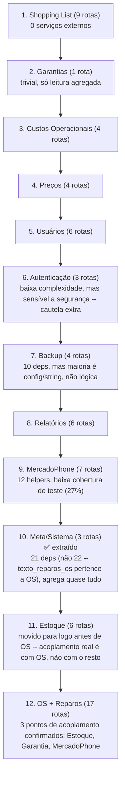

# API_DEPENDENCY_MATRIX — Matriz de Dependências por Domínio (TD-01)

**Gerado em:** 2026-08-04 (TD-01 Phase 1, a pedido do CTO)
**Método:** script determinístico (`grep`/regex sobre `fluxoly_blueprints_api.py`, não estimativa) —
para cada faixa de linhas de um domínio (mapeada na Phase 0), verifica quais das 79 chaves de `deps` e
quais dos ~25 helpers internos aparecem como uso real (não só definição). Módulo de origem de cada chave
de `deps` cruzado contra os imports de `app.py`.

**Não é documento definitivo** — é ferramenta de trabalho para a Phase 2: cada extração de domínio deve
conferir a linha correspondente antes de considerar o domínio concluído (ver checklist de Definition of
Done em `SPRINT_TD01_MODULARIZACAO_API.md`, Phase 2).

> **Correção pós-extração de Shopping (2026-08-04):** o scan original desta matriz só cobriu as ~25
> funções auxiliares definidas no bloco antes da primeira rota (linhas 104-421). A extração real de
> Shopping List encontrou `_log_shopping()` (helper específico do domínio, definido na linha 707 —
> **fora** desse bloco, imediatamente antes das rotas de Shopping) mais duas constantes locais
> (`SHOPPING_STATUSES`/`SHOPPING_PRIORITIES`, linhas 704-705). Um scan completo do arquivo (todo `def`
> de 4 espaços não precedido por `@api.route`) encontrou **33 helpers no total**, não 25 — os 8
> adicionais (`_sanitize_list`/`_sanitize_nested_obj` → Sistema; `_os_row_to_dict`/
> `_ordem_lista_por_id_desc` → OS; `_log_shopping` → Shopping, já extraído; `_classificar_garantia` →
> Garantias; `_password_reset_token_horas` → Usuários) estão espalhados perto das rotas que os usam, não
> no bloco inicial. **Cada domínio ainda não extraído deve refazer esse scan completo na sua própria
> Discovery Local** — não confiar só na contagem de helpers desta tabela para domínios ainda não
> tocados.

---

## Tabela resumo

| Módulo | Rotas | Helpers usados | Deps usadas | Serviços externos tocados |
|---|--:|--:|--:|---|
| `api_shopping.py` ✅ extraído | 9 | 4 (3 genéricos + `_log_shopping`) | 1 | (nenhum) |
| `api_garantias.py` ✅ extraído | 1 | 3 | 3 | `fluxoly_core`, `fluxoly_reports` |
| `api_costs.py` ✅ extraído | 4 | 4 | 2 | `fluxoly_reports` |
| `api_prices.py` ✅ extraído | 4 | 4 | 3 | `fluxoly_price_tables` |
| `api_users.py` ✅ extraído | 6 | 4 | 3 | `werkzeug.security` |
| `api_auth.py` ✅ extraído | 3 | 3 | 5 | `fluxoly_rate_limit`, `werkzeug.security` |
| `api_stock.py` | 6 | 7 | 3 | `fluxoly_os`, `fluxoly_reference_data` |
| `api_reports.py` ✅ extraído | 6 | 3 | 8 | `fluxoly_reports` |
| `api_backup.py` ✅ extraído | 4 | 5 | 10 | `fluxoly_storage` |
| `api_mercadophone.py` ✅ extraído | 7 | 9 | 9 | `fluxoly_mercadophone` |
| `api_system.py` ✅ extraído | 3 | 5 (3 genéricos + `_sanitize_list`/`_sanitize_nested_obj`) | 21 | `fluxoly_core`, `fluxoly_os`, `fluxoly_reference_data` (não `fluxoly_reports` — correção da Discovery Local, nenhuma chamada real encontrada) |
| `api_os.py` (+Reparos) | 17 | 11 | 32 | `fluxoly_audit`, `fluxoly_core`, `fluxoly_os`, `fluxoly_reference_data`, `fluxoly_reports`, `fluxoly_tipos_garantia_service` |

Ordenada por complexidade real (helpers + deps), não por ordem de domínio da Phase 0.

## Achado novo (corrige a Phase 0/1 anteriores)

1. **`api_system.py` (dashboard) é muito mais acoplado do que a Phase 1 original estimou.** Tinha sido
   classificado em "Tier 1 — zero acoplamento cruzado" com base só em `DOMAIN_MODEL.md`. A matriz mostra
   22 deps e 4 serviços externos (`fluxoly_core`, `fluxoly_os`, `fluxoly_reference_data`,
   `fluxoly_reports`) — `/api/dashboard` agrega dados de praticamente todo o sistema. **Reclassificado
   para perto do fim da ordem de extração** (ver seção "Ordem revisada" abaixo).
2. **Terceiro ponto de acoplamento de OS, não capturado na Phase 0: OS → MercadoPhone.**
   `listar_ordens()` (linha 1205-1207) chama `_carregar_config_mercadophone()` e
   `_atualizar_runtime_mercadophone()` para ler `mercado_phone_runtime_config["sync_start_date"]` e
   filtrar OS antigas da listagem. Isso significa que os helpers `_carregar_config_mercadophone`/
   `_atualizar_runtime_mercadophone` (originalmente presumidos específicos de `api_mercadophone.py`) são
   **compartilhados entre `api_os.py` e `api_mercadophone.py`** — não podem simplesmente migrar
   "junto com as rotas do domínio dono" como o resto dos helpers específicos. Decisão recomendada: mover
   essa lógica de config para dentro de `fluxoly_mercadophone.py` (módulo de serviço já existente, fora
   do blueprint) em vez de deixá-la como closure duplicável entre dois blueprints novos — mesma regra de
   reuso já estabelecida em `ENGINEERING_GUIDE.md` §3 ("importa o service do domínio dono, nunca duplica
   a lógica"). Fica registrado aqui como decisão a executar no início da extração de `api_os.py` ou
   `api_mercadophone.py` (o que vier primeiro entre os dois).
3. Confirma (sem alteração) os dois pontos já conhecidos: OS → Estoque (6 chamadas) e OS → Garantia
   (14 referências), ambos só dentro de `api_os.py`.

## Ordem de extração revisada

A ordem original da Phase 1 (baseada em `DOMAIN_MODEL.md`) tinha `api_system.py` no primeiro tier. Com
os dados reais da matriz, a ordem passa a ser por complexidade real crescente:

**Nota:** Shopping List assume a posição 1 (não Preços/Custos como na Phase 1 original) porque a matriz
mostra zero serviços externos tocados — a suposição da Phase 1 original de que dependia de Estoque
(`reposicao_sugerida_estoque`) era sobre o **frontend** consumindo um endpoint de Estoque, não sobre o
backend de Shopping chamando código de Estoque diretamente. Ordem entre módulos de complexidade
próxima (ex. Custos vs. Preços) não é rígida — ajustar se a Phase 2 encontrar algo não mapeado aqui.

**Ajuste (2026-08-06, após extração de Preços):** Estoque e Backup trocaram de posição em relação à
ordem original desta seção — Backup sobe para a posição 7 (baixo acoplamento real, maioria das deps é
config/string), Estoque desce para a posição 11, imediatamente antes de OS. Motivo: o acoplamento real
de Estoque é com OS (mesmos 3 pontos já mapeados na posição 12), não com o restante dos domínios
intermediários — quanto menos código sobrar no monólito antes de tocar Estoque/OS, mais simples fica a
extração dos dois domínios com maior acoplamento cruzado da Phase 2.

---

## Detalhe por módulo

### `api_auth.py` ✅ extraído em 2026-08-06
- **Helpers:** `err`, `ok`, `usuario_logado` (nenhum específico do domínio)
- **Deps (5):** `check_password_hash`, `conectar`, `limite_excedido`, `registrar_tentativa`, `resolver_ip_cliente`
- **Serviços:** `fluxoly_rate_limit`, `werkzeug.security`

### `api_os.py` (inclui Reparos catálogo padrão)
- **Helpers (11):** `_atualizar_runtime_mercadophone`\*, `_buscar_checklist_por_os`, `_buscar_checklist_por_token`, `_carregar_config_mercadophone`\*, `_checklist_status`, `_garantir_checklist_os`, `_texto_limpo_local`, `err`, `ok`, `usuario_admin`, `usuario_logado` — \*ver achado #2 acima
- **Deps (32):** `adicionar_peca_os_sem_consumir`, `buscar_garantia_reparo`, `buscar_historico_garantia_reparo`, `buscar_linhas_com_garantia_da_os`, `buscar_reparo_ids_da_os`, `calcular_faturamento_os`, `calcular_lucro_os`, `carregar_os_com_relacoes`, `conectar`, `consumir_peca_da_os`, `corrigir_garantia_reparo`, `devolver_pecas_da_os`, `gravar_garantias_reparo`, `mercado_phone_runtime_config`, `modelo_compativel`, `modelo_para_os`, `normalizar_imei`, `normalizar_status_os`, `obter_reparos_por_os`, `obter_tipo_garantia`, `parse_data_ymd`, `registrar_log_auditoria`, `resolver_garantias_reparo`, `salvar_reparos_os`, `status_aberto`, `status_cancelado`, `status_finalizado`, `texto_reparos_os`, `validar_reparo_ids`, `vendedor_valido`, `vendedores`, `zerar_garantia_reparo`
- **Serviços:** `fluxoly_audit`, `fluxoly_core`, `fluxoly_os`, `fluxoly_reference_data`, `fluxoly_reports`, `fluxoly_tipos_garantia_service`

### `api_stock.py`
- **Helpers:** `_normalizar_qualidade_estoque`, `_normalizar_tipo_estoque`, `_recalcular_custo_medio`, `_status_item_estoque`, `err`, `ok`, `usuario_logado`
- **Deps (3):** `conectar`, `normalizar_modelo_iphone`, `registrar_movimentacao`
- **Serviços:** `fluxoly_os`, `fluxoly_reference_data`

### `api_shopping.py` ✅ extraído em 2026-08-04 (commit a seguir)
- **Helpers:** `err`, `ok`, `usuario_logado` (movidos para `fluxoly_api_helpers.py`, primeiro uso —
  comprovado usado por 2+ domínios); `_log_shopping()` (específico do domínio, não estava no scan
  original desta matriz — ver correção no topo do documento)
- **Deps (1):** `conectar`
- **Serviços:** (nenhum)
- **Constantes locais movidas junto:** `SHOPPING_STATUSES`, `SHOPPING_PRIORITIES`

### `api_reports.py` ✅ extraído em 2026-08-06
- **Helpers:** `err`, `ok`, `usuario_logado` (nenhum específico do domínio)
- **Deps (8, não 9):** `agrupar_relatorio_custos_operacionais`, `agrupar_relatorio_ir_phones`, `agrupar_relatorio_tecnicos`, `formatar_periodo_relatorio`, `montar_linhas_relatorio_custos_operacionais`, `montar_linhas_relatorio_ir_phones`, `montar_linhas_relatorio_tecnicos`, `montar_pdf_texto`. **Correção da Discovery Local:** `tecnicos` (lista de técnicos) não é usada em nenhuma das 6 rotas — pertence ao domínio Sistema (`/dashboard`), estimativa da Phase 1 estava incorreta
- **Serviços:** `fluxoly_reports` (não `fluxoly_reference_data` — nenhuma chamada real encontrada)
- **Consumidor cruzado (não migrado):** 6 das 8 deps (todas exceto `agrupar_relatorio_custos_operacionais`/`montar_linhas_relatorio_custos_operacionais`) também são usadas por `create_main_blueprint` (`fluxoly_blueprints_main.py`, páginas renderizadas no servidor) — dict separado, verificado intacto antes e depois da extração, não faz parte deste domínio

### `api_users.py` ✅ extraído em 2026-08-06
- **Helpers:** `err`, `ok`, `usuario_admin`, `usuario_logado` (de `fluxoly_api_helpers.py`);
  `_password_reset_token_horas()` (específico do domínio, migrou junto)
- **Deps (3):** `conectar`, `generate_password_hash`, `perfis_opcoes`
- **Serviços:** `werkzeug.security` (`generate_password_hash`) — **correção da Discovery Local:**
  `fluxoly_core` não é tocado por nenhuma das 6 rotas reais (leitura de código não encontrou nenhuma
  chamada); estimativa da Phase 1 estava incorreta, mesmo padrão de correção já visto em Shopping List

### `api_costs.py` ✅ extraído em 2026-08-06
- **Helpers:** `err`, `ok`, `usuario_admin`, `usuario_logado`
- **Deps (2):** `conectar`, `listar_custos_operacionais`
- **Serviços:** `fluxoly_reports`

### `api_prices.py` ✅ extraído em 2026-08-06
- **Helpers:** `err`, `ok`, `usuario_admin`, `usuario_logado`
- **Deps (3):** `carregar_tabelas_preco`, `conectar`, `salvar_tabelas_preco`
- **Serviços:** `fluxoly_price_tables` (`sugerir_preco_tabela`)

### `api_backup.py` ✅ extraído em 2026-08-06
- **Helpers:** `_texto_limpo_local` (promovido para `fluxoly_api_helpers.py` nesta extração — comprovadamente
  compartilhado com MercadoPhone, ainda no monólito); `err`, `ok`, `usuario_admin`, `usuario_logado`
- **Deps (10):** `backup_dir`, `backup_email_destino`, `backup_email_remetente`, `backup_email_senha_app`, `conectar`, `criar_backup`, `db_path`, `enviar_backup_email`, `forcar_migracao_schema`, `google_drive_backup_dir`
- **Serviços:** `fluxoly_storage` (a maioria das deps é configuração/string, não chamada de lógica — complexidade real menor do que a contagem sugere). `garantir_pasta_backup_google_drive` permanece como dep morta em `create_api_blueprint` (Phase 0, candidata a limpeza na Phase 3) — não pertence a este domínio

### `api_mercadophone.py` ✅ extraído em 2026-08-06
- **Helpers:** `_executar_reimportacao_mp_async`, `_executar_reprocessamento_mp_async`, `_snapshot_reimportacao_mp`, `_snapshot_reprocessamento_mp`, `_to_bool` (específicos do domínio); `err`, `ok`, `usuario_admin`, `usuario_logado`, `_texto_limpo_local` (de `fluxoly_api_helpers.py`). `_carregar_config_mercadophone`/`_atualizar_runtime_mercadophone` **não migraram como helper** — foram promovidas a `carregar_config_mercadophone()`/`atualizar_runtime_mercadophone()` em `fluxoly_mercadophone.py` (funções de serviço com parâmetros explícitos, não closures), porque `listar_ordens()` (domínio OS, ainda não extraído) também as usa — achado da Discovery, ver log de execução da Phase 2
- **Deps (9):** `conectar`, `integrations_config_path`, `mercado_phone_helpers`, `mercado_phone_runtime_config`, `reimportar_todas_os_mercado_phone`, `reprocessar_todas_os_mercado_phone`, `salvar_configuracoes_integracoes`, `sincronizar_mercado_phone`, `carregar_configuracoes_integracoes`
- **Serviços:** `fluxoly_mercadophone`

### `api_system.py` ✅ extraído em 2026-08-07
- **Helpers:** `err`, `ok`, `usuario_logado` (de `fluxoly_api_helpers.py`); `_sanitize_list`/
  `_sanitize_nested_obj` (específicos do domínio, usados só em `constantes()`, migraram junto)
- **Deps (21, não 22):** `calcular_faturamento_os`, `calcular_lucro_os`, `carregar_os_com_relacoes`, `categorias_custos`, `conectar`, `estoque_qualidades`, `estoque_tipos`, `garantia_reparo_dias_padrao`, `iphone_colors`, `iphone_models`, `listar_custos_operacionais`, `normalizar_status_os`, `obter_alertas_sistema`, `os_tipos_opcoes`, `produtos_categorias`, `produtos_condicoes`, `reparos_padrao`, `status_aberto`, `status_cancelado`, `status_finalizado`, `status_os_opcoes`, `tecnicos`, `vendedores`. **Correção da Discovery Local:** `texto_reparos_os` não é usado em nenhuma das 3 rotas — pertence a `_os_row_to_dict()` (domínio OS, função fisicamente adjacente a `dashboard()` mas fora dela), estimativa original estava incorreta (mesmo padrão de correção já visto em Usuários/Relatórios). `estoque_tipos`/`estoque_qualidades` são novas nesta extração — promovidas de constantes locais do monólito para `fluxoly_reference_data.py` (achado de acoplamento com Estoque, ver log de execução da Phase 2)
- **Serviços:** `fluxoly_core`, `fluxoly_os` (`carregar_os_com_relacoes`), `fluxoly_reference_data` — **correção da Discovery Local:** `fluxoly_reports` não é tocado por nenhuma das 3 rotas reais (nenhuma chamada encontrada), estimativa da Phase 1 estava incorreta

### `api_garantias.py` ✅ extraído em 2026-08-05
- **Helpers:** `err`, `ok`, `usuario_logado` (de `fluxoly_api_helpers.py`); `_classificar_garantia`
  (específico do domínio, migrou junto)
- **Deps (3):** `conectar`, `garantia_reparo_dias_padrao`, `parse_data_ymd`
- **Serviços:** `fluxoly_core`, `fluxoly_reports`

---

## Documentos relacionados

- `docs/operations/SPRINTS/SPRINT_TD01_MODULARIZACAO_API.md` — Phase 0 (Discovery) e Phase 1 (Design)
- `docs/engineering/adr/ADR-002.md` — decisão de fundo e módulos planejados
