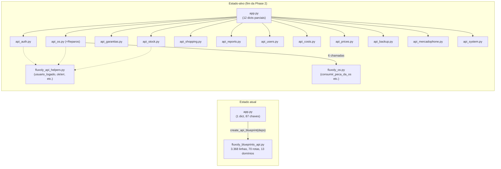

# SPRINT TD-01 — Modularização de `fluxoly_blueprints_api.py`

**Status:** EM ANDAMENTO (Phase 1 concluída, Phase 2 em andamento — 11/12 domínios extraídos)
**Início:** 2026-08-04
**Tipo:** Refatoração (arquitetura)

---

## Objetivo

Decompor `fluxoly_blueprints_api.py` (3.368 linhas, 70 rotas, 13 domínios, 79 valores injetados via
`create_api_blueprint(deps)`) em módulos por domínio, seguindo a decisão de fundo já aceita em `ADR-002`
(atualizada por `ADR-011` e por este Discovery), sem quebrar nenhum dos 682 testes existentes.

## Motivação

TD-01/KI-003 — módulo único demasiado grande, concentra 13 domínios de negócio sem separação. Qualquer
alteração aumenta risco de regressão e dificulta onboarding. Decisão de decompor já tomada há um mês
(`ADR-002`, 2026-07-06) e nunca executada — `ADR-011` formalizou a separação de escopo em relação à
Sprint Housekeeping (TD-12) para não repetir esse padrão.

## Método

Quatro fases, cada uma com saída própria antes de avançar para a próxima. Nenhuma extração de código
acontece antes da Phase 1 estar aprovada.

```
Phase 0 — Architecture Discovery   (este documento)
Phase 1 — Architecture Design      (ADR revisada + plano de migração + rollback)
Phase 2 — Incremental Extraction   (um domínio por vez: extração → testes → CI → Graphify → merge)
Phase 3 — Cleanup                  (código morto, wrappers temporários, documentação, reindexação)
```

Compromisso mantido ao longo das 4 fases: nenhuma mudança estrutural sem Discovery, nenhuma
implementação sem plano aprovado, nenhuma decisão arquitetural sem ADR/plano documentado, cada extração
pequena/testada/reversível/validada por CI (e Graphify, uma vez indexado) antes da próxima.

---

## Phase 0 — Architecture Discovery

**Método:** extração determinística via `grep`/`awk` sobre `fluxoly_blueprints_api.py` (não estimativa)
— toda contagem abaixo é verificável linha a linha. Cruzado contra `ADR-011` (2026-08-03),
`docs/engineering/DOMAIN_MODEL.md` e `docs/engineering/ENGINEERING_GUIDE.md` §3 (convenção
controller/service/repository). Nenhum código foi alterado nesta fase.

### 1. Mapa dos 70 endpoints

Todas as 70 rotas (`@api.route(...)`) mapeadas para método HTTP, path e função handler. Confirma
exatamente a contagem de `ADR-011` — nenhuma divergência encontrada.

| # | Domínio | Rotas | Endpoints (método, path → função) |
|---|---|--:|---|
| 1 | Autenticação | 3 | `POST /auth/login`→`auth_login`, `POST /auth/logout`→`auth_logout`, `GET /auth/me`→`auth_me` |
| 2 | Ordens de Serviço (OS) | 13 | `GET/POST /ordens`→`listar_ordens`/`criar_ordem`, `GET/PUT/DELETE /ordens/<id>`→`obter_ordem`/`atualizar_ordem`/`deletar_ordem`, `PATCH /ordens/<id>/status`→`atualizar_status_os`, `GET /ordens/<id>/checklist`→`obter_checklist_os`, `POST /ordens/<id>/checklist/token`→`gerar_token_checklist_os`, `GET/POST /checklist/<token>`→`obter_checklist_publico`/`salvar_checklist_publico`, `PATCH /ordens/<id>/reparos/<rid>/garantia`→`corrigir_garantia_reparo_route`, `GET /ordens/<id>/reparos/<rid>/historico-garantia`→`historico_garantia_reparo_route`, `GET /ordens/historico-cliente`→`historico_cliente` |
| 3 | Shopping List | 9 | `GET/POST /shopping-list`→`shopping_list`/`shopping_create`, `GET/PUT/DELETE /shopping-list/<id>`→`shopping_get`/`shopping_update`/`shopping_delete`, `PATCH /shopping-list/<id>/status`→`shopping_patch_status`, `GET /shopping-list/grouped`→`shopping_grouped`, `GET /shopping-list/<id>/logs`→`shopping_logs`, `GET /shopping-list/logs/export`→`shopping_logs_export` |
| 4 | Estoque | 6 | `GET/POST /estoque`→`listar_estoque`/`criar_estoque`, `PUT/DELETE /estoque/<id>`→`atualizar_estoque`/`deletar_estoque`, `GET /estoque/reposicao-sugerida`→`reposicao_sugerida_estoque`, `GET /estoque/movimentacoes`→`movimentacoes` |
| 5 | Relatórios (+PDF) | 6 | `GET /relatorios/{ir-phones,tecnicos,custos-operacionais}` + `GET /relatorios/pdf/{ir-phones,tecnicos,custos-operacionais}` |
| 6 | Usuários | 6 | `GET/POST /usuarios`→`listar_usuarios`/`criar_usuario`, `PUT/DELETE /usuarios/<id>`→`atualizar_usuario`/`deletar_usuario`, `POST /usuarios/<id>/reset-token`→`gerar_token_reset_senha`, `POST /password-reset/<token>`→`consumir_token_reset_senha` |
| 7 | Reparos (catálogo padrão) | 4 | `GET/POST /reparos`→`listar_reparos`/`criar_reparo`, `PUT/DELETE /reparos/<id>`→`atualizar_reparo`/`deletar_reparo` |
| 8 | Custos Operacionais | 4 | `GET/POST /custos`→`listar_custos`/`criar_custo`, `PUT/DELETE /custos/<id>`→`atualizar_custo`/`deletar_custo` |
| 9 | Preços | 4 | `GET/POST /precos`→`listar_precos`/`salvar_preco`, `POST /precos/excluir`→`excluir_preco`, `GET /precos/sugerir`→`sugerir_preco` |
| 10 | Backup | 4 | `POST /backup/criar`→`criar_backup_api`, `GET /backup/listar`→`listar_backups`, `GET /backup/download/<file>`→`download_backup`, `POST /backup/restaurar`→`restaurar_backup_upload` |
| 11 | Integrações MercadoPhone | 7 | `POST /integracoes/mercadophone/sincronizar`→`sincronizar_mercadophone`, `POST/GET /reprocessar`(+`/status`), `POST/GET /reimportar`(+`/status`), `GET /status`, `POST /config` |
| 12 | Meta/Sistema | 3 | `GET /constantes`, `GET /alertas`, `GET /dashboard` |
| 13 | Garantias (agregada) | 1 | `GET /garantias`→`listar_garantias` |
| | **Total** | **70** | |

### 2. Mapa das dependências injetadas

`create_api_blueprint(deps)` (linha 23) recebe **79 valores** desestruturados de `deps` logo no início da
função: **78** via `deps["chave"]` (obrigatórios) + **1** via `deps.get("public_base_url", "")`
(opcional). `ADR-011` registrou "78" — a diferença é essa única chave opcional, que grep de `deps\[`
sozinho não captura.

Categorias (não exaustivo por nome, mas cobre a totalidade das 79):
- **Funções de domínio** (a maioria): OS/garantia (`consumir_peca_da_os`, `devolver_pecas_da_os`,
  `resolver_garantias_reparo`, `obter_tipo_garantia`, ~20 nomes), relatórios (`agrupar_relatorio_*`,
  `montar_linhas_relatorio_*`, `montar_pdf_texto`, ~10 nomes), preços (`carregar_tabelas_preco`,
  `salvar_tabelas_preco`), auditoria (`registrar_log_auditoria`), backup
  (`criar_backup`/`enviar_backup_email`/`garantir_pasta_backup_google_drive`), rate limit
  (`resolver_ip_cliente`/`limite_excedido`/`registrar_tentativa`), MercadoPhone (`sincronizar_mercado_phone`
  e variantes), senha (`check_password_hash`/`generate_password_hash`)
- **Constantes/listas de referência**: `iphone_models`, `iphone_colors`, `vendedores`, `tecnicos`,
  `status_os_opcoes`, `os_tipos_opcoes`, `perfis_opcoes`, `categorias_custos`, `reparos_padrao`,
  `produtos_categorias`, `produtos_condicoes`, `garantia_reparo_dias_padrao`
- **Configuração/ambiente**: `backup_dir`, `google_drive_backup_dir`, `backup_email_*` (3), `db_path`,
  `integrations_config_path`, `public_base_url`, `mercado_phone_runtime_config`,
  `mercado_phone_helpers`
- **Infraestrutura**: `conectar` (conexão SQLite), `forcar_migracao_schema`

**Confirma o achado de `AUDIT_DEPENDENCIES.md`:** nenhum desses 79 aparece como `import` de módulo —
grep estrutural de imports subestima sistematicamente o acoplamento real deste arquivo. Qualquer
ferramenta de análise de impacto (Graphify incluso, até reindexação pós-Phase 2) deve tratar esta lista
como a superfície de acoplamento real, não os imports do topo do arquivo.

### 3. Pontos de acoplamento cruzado (evidência, não estimativa)

- **OS → Estoque:** 6 chamadas diretas a funções de estoque dentro da seção de rotas de OS (linhas
  1191-2031): `consumir_peca_da_os` (2×), `devolver_pecas_da_os` (3×), `adicionar_peca_os_sem_consumir`
  (1×) — em `criar_ordem`, `atualizar_ordem` e `atualizar_status_os`.
- **OS → Garantia de reparo:** 14 referências a funções/conceitos de garantia dentro da mesma seção —
  confirma a observação de `ADR-011` de que a maior parte da lógica de garantia injetada só serve rotas
  de OS.
- **OS → MercadoPhone (achado na Phase 1, não capturado aqui):** `listar_ordens()` chama
  `_carregar_config_mercadophone()`/`_atualizar_runtime_mercadophone()` para filtrar OS por
  `sync_start_date`. Ver `docs/engineering/API_DEPENDENCY_MATRIX.md` para o detalhe e a recomendação
  (mover essa lógica de config para `fluxoly_mercadophone.py`).
- **`ENGINEERING_GUIDE.md` §3 já prescreve a resolução para o primeiro ponto:** a lógica de movimentação
  de estoque hoje embutida em `fluxoly_os.py` (`registrar_movimentacao`, `consumir_peca_da_os`,
  `_consumir_lotes_fifo`) é "a candidata natural a virar `irflow_estoque_service.py` formal — OS, Vendas
  e Compras devem consumir esse mesmo service, nunca reimplementar a baixa de estoque cada um à sua
  maneira". Isto não é uma proposta nova deste Discovery — é uma decisão já registrada, ainda não
  executada, que a Phase 1 deveria adotar como parte do design de `api_os.py`/`api_stock.py`.

### 4. Validação da proposta de módulos (`ADR-002`, atualizada nesta Phase 0)

A aproximação preliminar do CTO citada em `ADR-011` (12 nomes) cobre 12 dos 13 domínios — não faltava
nome, faltava mapeamento: **"Reparos" (catálogo padrão, 4 rotas) funde-se em `api_os.py`**, confirmado por
`DOMAIN_MODEL.md` §1.3, que já lista a tabela `reparos` entre as tabelas do domínio OS. Lista completa e
validada registrada em `ADR-002` (seção "Módulos planejados", atualizada nesta sessão) — 12 módulos para
os 13 domínios reais.

### 5. Lacunas de documentação encontradas (não bloqueiam a Phase 1, mas devem ser corrigidas nela)

- `DOMAIN_MODEL.md` não tem entrada própria para **Custos Operacionais** — hoje só aparece na seção
  "O que ainda não é um domínio isolado", ligado a um futuro Financeiro/Caixa que não existe. A Phase 1
  precisa decidir se `api_costs.py` nasce como domínio próprio ou como sub-rota de outro.
- `DOMAIN_MODEL.md` §1.3 (OS) não menciona garantia de reparo (V1.5, `os_reparos`/garantia inline) nem
  o endpoint agregado `/garantias` — a tabela de dependências desse domínio está desatualizada em relação
  ao estado real do código.
- `ROUTE_PERMISSIONS` (dict de autorização por endpoint, `app.py` linha 1882) vive fora do blueprint —
  qualquer decomposição precisa decidir se esse dict acompanha os módulos novos, é fatiado por domínio,
  ou permanece centralizado em `app.py`. Não decidido nesta Phase 0, fica para Phase 1.
- Autenticação e Usuários hoje têm **duas implementações paralelas** (`fluxoly_blueprints_auth.py`
  legado + rotas dentro de `fluxoly_blueprints_api.py`), já registrado em `ARCHITECTURE.md` §3 e
  `DOMAIN_MODEL.md` §1.1 — a Phase 1 precisa decidir se `api_auth.py`/`api_users.py` absorvem também a
  superfície legada ou convivem com ela.

### 6. Único importador confirmado

`app.py` linha 2027 é o único ponto de chamada de `create_api_blueprint(deps)` — confirma `ADR-011`
(a linha mudou de 1911 para 2027 por edições posteriores não relacionadas, ex. `python-dotenv`). Qualquer
estratégia de migração incremental (Phase 2) precisa decidir como múltiplos blueprints coexistem nesse
único ponto de registro durante a transição (todos os domínios ainda não extraídos continuam saindo de
`create_api_blueprint`, os já extraídos registram blueprint próprio) — pergunta em aberto para Phase 1.

### 7. Perguntas em aberto para a Phase 1 (não respondidas aqui, propositalmente)

1. Qual domínio extrair primeiro? (Candidatos por menor acoplamento cruzado: Preços, Backup, Meta/Sistema,
   Custos — todos com "Depende de: nenhum outro domínio" ou próximo disso.)
2. `ROUTE_PERMISSIONS` acompanha os módulos ou permanece centralizado?
3. `api_os.py`/`api_stock.py` adotam a recomendação já existente do `ENGINEERING_GUIDE.md` de extrair
   `estoque_service.py` formal, ou a decomposição da API acontece primeiro e o service depois?
4. Layout físico: arquivo único `api_<dominio>.py` (mais próximo do texto de `ADR-002`) ou trio
   `fluxoly_<dominio>_controller.py`/`_service.py`/`_repository.py` (convenção de `ENGINEERING_GUIDE.md`
   §3.1, já aplicada em Clientes/Unidades Serializadas/Produtos/Vendas)?
5. Como preservar compatibilidade de rotas durante a migração incremental (Phase 2) sem registrar a
   mesma rota Flask duas vezes?
6. Estratégia de rollback por domínio extraído — reverter um commit de extração deveria ser suficiente,
   mas precisa validação explícita no plano de Phase 1.

---

## Phase 1 — Architecture Design

**Status:** CONCLUÍDA (2026-08-04). Nenhum código alterado — respostas às 6 perguntas da Phase 0,
validadas por leitura direta do código (mesmo método da Phase 0), mais um achado novo (helpers
compartilhados) que a Phase 0 não tinha mapeado.

### 0. Achado novo: helpers compartilhados (closures)

Os 70 endpoints não são a superfície inteira a migrar. `create_api_blueprint` define **~25 funções
auxiliares** antes da primeira rota, todas fechadas sobre o mesmo escopo (`deps` desestruturado). Duas
categorias, confirmadas por leitura:

- **Genéricas** (usadas por múltiplos domínios): `usuario_logado()`, `usuario_admin()`, `err(msg, code)`,
  `ok(data, **kwargs)`, `_texto_limpo_local()`, `_to_bool()`. Precisam de um lar compartilhado — nenhum
  dos 12 módulos novos é "dono" delas.
- **Específicas de um domínio**: ex. `_slug_estoque`/`_normalizar_tipo_estoque`/`_gerar_sku_estoque`/
  `_recalcular_custo_medio` (Estoque), `_parse_checklist_json`/`_checklist_status`/`_serialize_checklist`/
  `_buscar_checklist_por_os` (OS/checklist), `_snapshot_reprocessamento_mp`/
  `_executar_reprocessamento_mp_async` (MercadoPhone). Migram junto com as rotas do domínio dono.

**Decisão:** criar `fluxoly_api_helpers.py` (módulo novo, sem prefixo de domínio) só para as funções
genéricas. Cada `api_<dominio>.py` importa dele o que precisar. Inventário exaustivo das ~25 funções
(qual é genérica vs. específica de qual domínio) fica para o início da Phase 2, feito uma vez por domínio
extraído — não vale a pena enumerar as 25 aqui sem o contexto de qual domínio está sendo tocado no
momento.

**Regra de admissão (evita que `fluxoly_api_helpers.py` vire um mini-monólito novo):** nenhum helper
migra para lá "por conveniência". Só entra quando, na extração, ficar comprovado que **dois ou mais**
domínios já extraídos o usam de fato (mesmo teste do achado #2 da `API_DEPENDENCY_MATRIX.md`, que
encontrou `_carregar_config_mercadophone`/`_atualizar_runtime_mercadophone` compartilhados entre OS e
MercadoPhone). Um helper usado por um único domínio permanece nesse domínio, mesmo que pareça genérico
pelo nome.

### 1. Respostas às 6 perguntas da Phase 0

| # | Pergunta | Resposta | Evidência |
|---|---|---|---|
| 2 | `ROUTE_PERMISSIONS` acompanha os módulos? | **Não se aplica.** Confirmado por leitura de `app.py` linha 1882: o dict só tem entradas para `auth_views.*`/`main_views.*`/`static`/o webhook do MercadoPhone — nenhuma das 70 rotas `/api/*` está lá. A autorização de `/api/*` é feita **inline**, dentro de cada handler (`if session.get("usuario_perfil") not in (...)`), ~15 padrões ligeiramente diferentes espalhados pelo arquivo. Migra junto com o handler, sem mudança de comportamento — não é uma decisão a tomar, é um não-problema que a Phase 0 registrou por precaução antes de verificar. |
| 3 | `estoque_service.py` antes ou depois? | **Nem um nem outro — são independentes.** As funções de movimentação de estoque (`consumir_peca_da_os`, `devolver_pecas_da_os`, etc.) já vivem em `fluxoly_os.py`, não dentro do blueprint — extrair `api_os.py`/`api_stock.py` não exige mexer nelas primeiro. Formalizá-las em `estoque_service.py` (recomendação já registrada em `ENGINEERING_GUIDE.md`) é uma melhoria de camada de serviço, ortogonal a esta refatoração de blueprint. **Decisão:** fora do escopo de TD-01, registrar como item de dívida técnica separado (candidato a TD-16) para não misturar os dois tipos de refatoração no mesmo commit. |
| 4 | Layout físico: arquivo único ou trio controller/service/repository? | **Arquivo único `api_<dominio>.py`** (um `Blueprint` por domínio, sem repository/service novos). `ENGINEERING_GUIDE.md` §3 é explícito: a convenção de camadas obrigatória vale para "qualquer domínio de negócio novo… não se aplica retroativamente aos domínios existentes… esses seguem seu próprio plano de decomposição (`ADR-002`)". Adotar o trio completo para 12 domínios de uma vez seria reescrita, não decomposição — contradiz a razão de `ADR-002` ter vencido a Opção B (FastAPI) e a Opção A (manter tudo). Um domínio pode evoluir para o trio completo depois, individualmente (mesmo caminho que Vendas/Clientes/Produtos já percorreram), mas isso é decisão de cada domínio, não desta sprint. |
| 5 | Como coexistir rotas durante a migração incremental? | **Múltiplos `Blueprint` com o mesmo `url_prefix="/api"`, cada um com nome único.** Já é o padrão do projeto: `auth_views` e `main_views` coexistem no mesmo app Flask hoje. Mecânica por domínio extraído: (1) criar `api_<dominio>.py` com `create_api_<dominio>_blueprint(deps)` retornando `Blueprint("api_<dominio>", __name__, url_prefix="/api")`; (2) **remover** as rotas equivalentes de `fluxoly_blueprints_api.py` no mesmo commit (nunca duplicar — Flask rejeita duas regras idênticas); (3) registrar o blueprint novo em `app.py` ao lado do antigo. Testes não precisam mudar: os 6 arquivos de teste que citam `fluxoly_blueprints_api.py` fazem isso só em docstring/comentário — nenhum importa a função diretamente, todos batem em URLs via `Flask test client`. |
| 6 | Estratégia de rollback? | **Um commit por domínio extraído, `git revert` reverte sozinho.** Cada commit de extração: move rotas + helpers específicos, atualiza `app.py` (novo dict `deps` parcial + registro do blueprint), roda a suíte completa (682+ testes) antes do merge. Se um problema aparecer depois do merge, reverter o commit único restaura o domínio inteiro no arquivo monolítico sem afetar os domínios já extraídos antes dele (branches Blueprint independentes, sem dependência estrutural entre commits de domínios diferentes). |
| 1 | Qual domínio extrair primeiro? | Ver ordem recomendada abaixo — não é resposta única, é uma sequência. |

### 2. Ordem de extração recomendada

> **Superseded (2026-08-04, mesma sessão):** a versão original desta seção classificava `api_system.py`
> no Tier 1 ("zero acoplamento"), baseada em `DOMAIN_MODEL.md`. Construir
> `docs/engineering/API_DEPENDENCY_MATRIX.md` (a pedido do CTO, para servir de checklist objetivo da
> Phase 2) mediu o acoplamento real por contagem de `deps`/helpers/serviços tocados e mostrou que
> `/api/dashboard` agrega 22 dependências e 4 serviços — a suposição original estava errada. **A ordem
> vigente é a da seção "Ordem de extração revisada" em `API_DEPENDENCY_MATRIX.md`**, não a lista abaixo,
> mantida só para registro histórico da correção:

Ordem original (não vigente): Preços → Custos → Backup → Garantias → Sistema → Usuários → Estoque →
Shopping → Auth → MercadoPhone → Relatórios → OS. Ordem vigente (por complexidade real medida):
Shopping → Garantias → Custos → Preços → Usuários → Auth → Estoque → Relatórios → Backup →
MercadoPhone → **Sistema** (reclassificado) → OS. Ver `API_DEPENDENCY_MATRIX.md` para o diagrama
completo e a justificativa item a item.

> **Ajuste (2026-08-06, após extração de Preços):** Estoque e Backup trocaram de posição — Backup sobe
> (baixo acoplamento real, maioria das deps é config/string), Estoque desce para imediatamente antes de
> OS (o acoplamento real de Estoque é com OS, não com o restante dos domínios intermediários). **Ordem
> vigente atualizada:** Shopping → Garantias → Custos → Preços → Usuários → Auth → Backup → Relatórios →
> MercadoPhone → Sistema → Estoque → OS. Ver nota equivalente em `API_DEPENDENCY_MATRIX.md`.

### 3. Particionamento de `deps`

Hoje `app.py` monta **um único dict** com 87 chaves (79 realmente lidas pelo blueprint — ver Phase 0
seção 2 — as 8 restantes já são código morto, candidatas a limpeza na Phase 3) e passa para
`create_api_blueprint`. **Decisão:** cada `create_api_<dominio>_blueprint(deps)` novo recebe **só as
chaves que seu domínio usa** — não o dict inteiro. `app.py` monta um dict menor por chamada. Funções
usadas por mais de um domínio (ex. `conectar`, `registrar_log_auditoria`) são passadas para todos os
dicts que precisam — duplicar a passagem é aceitável (é só uma referência à mesma função), duplicar a
lógica não seria.

### 4. Diagrama — estado atual vs. estado-alvo



### 5. Riscos identificados nesta Phase (além dos já registrados na Phase 0)

| ID | Risco | Mitigação |
|----|-------|-----------|
| RS-01 | Helper genérico usado por um domínio sem ser percebido como genérico durante a extração (ex. um `_slug_estoque` sendo usado fora de Estoque sem estar mapeado) | Rodar suíte completa (682+ testes) a cada extração, não só os testes do domínio tocado |
| RS-02 | `deps` parcial esquecer uma chave que o domínio usa, causando `KeyError` só em runtime (não em import) | Testar boot local (`python app.py` ou suíte) sempre inclui exercitar as rotas do domínio extraído, não só importar o módulo |
| RS-03 | Extração de OS (Tier 3, por último) descobrir que o acoplamento com Estoque é mais profundo do que as 6 chamadas mapeadas | Se acontecer, é motivo para reabrir Phase 1 só para OS/Estoque, não para forçar a extração — critério de parada já coerente com a filosofia do projeto (ver `ENGINEERING_GUIDE.md` seção 11) |

---

## Phase 2 — Incremental Extraction

**Status:** EM ANDAMENTO — 10 de 12 domínios extraídos (Shopping List, 2026-08-04; Garantias, 2026-08-05; Custos Operacionais, 2026-08-06; Preços, 2026-08-06; Usuários, 2026-08-06; Auth, 2026-08-06; Backup, 2026-08-06; Relatórios, 2026-08-06; MercadoPhone, 2026-08-06; Sistema, 2026-08-07). Regras de execução
definidas na Phase 1, para não decidir mecânica no meio da extração:

**Unidade de trabalho = um domínio inteiro por commit, nunca uma rota isolada.** Cada commit de extração
segue sempre a mesma sequência interna: helpers do domínio → `deps` parcial → `Blueprint` novo → suíte
completa → Graphify (`graphify update .`) → commit. Extrair rota a rota quebraria a coesão do domínio e
multiplicaria o número de vezes que a suíte completa precisa rodar sem reduzir risco.

**Definition of Done por domínio extraído** — todos os 6 critérios, sem exceção, antes do commit:

- [ ] Rota(s) do domínio movidas para `api_<dominio>.py`, registrando `Blueprint("api_<dominio>", __name__, url_prefix="/api")`
- [ ] Helpers específicos do domínio (ver `API_DEPENDENCY_MATRIX.md`) migrados junto; helpers genéricos importados de `fluxoly_api_helpers.py`
- [ ] `deps` reduzido: `app.py` monta um dict só com as chaves daquele domínio (conferir contra a linha do domínio na matriz). Se uma chave for **removida** (não só particionada, como em Preços/`carregar_tabelas_preco`) por não ter mais consumidor no monólito, confirmar com `graphify affected "<funcao>"`/`graphify explain "<funcao>"` **antes** de remover — não só `grep` (achado do CTO após a extração de Preços, 2026-08-06: grep não pega injeção por `deps`/chamada indireta)
- [ ] Suíte completa passando (682+ testes, não só os testes do domínio tocado — ver RS-01)
- [ ] `graphify update .` rodado e validado com duas consultas: `graphify explain "api_<dominio>"` confirma que o módulo novo aparece no grafo com as arestas esperadas; `graphify affected "fluxoly_blueprints_api.py"` confirma que o arquivo monolítico não mantém nenhuma relação residual inesperada com o domínio recém-extraído
- [ ] Nenhuma referência residual ao domínio em `fluxoly_blueprints_api.py` (nem rota, nem helper específico, nem menção em comentário desatualizado)
- [ ] **Se o domínio não tem teste automatizado dedicado** (confirmar com `grep -rl "<termo-do-dominio>" tests/` antes de começar — ver achado do domínio Relatórios, 2026-08-06, KI-031): rodar um smoke test manual (Flask test client, banco temporário isolado, nunca o banco de desenvolvimento real) exercitando cada rota do domínio e confirmando HTTP 200/comportamento esperado, **antes** do commit. Não substitui teste automatizado — só reduz o risco de mover código sem nenhuma rede de segurança enquanto a sprint de cobertura não existe

Ordem de extração: ver `docs/engineering/API_DEPENDENCY_MATRIX.md`, seção "Ordem de extração revisada".

### Log de execução

**1. Shopping List (2026-08-04) — ✅ concluído, todos os 6 critérios do DoD.**
- `api_shopping.py` criado (9 rotas), `fluxoly_api_helpers.py` criado (primeiro uso — `err`/`ok`/
  `usuario_logado`, comprovadamente usados por múltiplos domínios já na matriz da Phase 1).
- **Achado durante a Discovery Local** (não estava na `API_DEPENDENCY_MATRIX.md` original): `_log_shopping()`
  é um helper específico do domínio definido na linha 707, fora do bloco de helpers mapeado na Phase 1
  (linhas 104-421). Motivou um re-scan completo do arquivo, que encontrou **33 helpers reais, não 25** —
  matriz corrigida com a lista completa e um aviso para as próximas extrações refazerem esse scan.
  `_ordem_lista_por_id_desc()` (linha 1182, logo após o bloco de Shopping) foi identificada como
  pertencente a OS, não a Shopping — não migrou.
- Suíte completa (682 testes) passando após a extração, sem alteração de nenhum teste.
- `graphify . --code-only` (primeira indexação real do repo, código apenas — sem custo de LLM) +
  `graphify explain "api_shopping"` (conexões esperadas: `fluxoly_api_helpers`, `fluxoly_validation`,
  importado por `app.py`) + `graphify affected "fluxoly_blueprints_api.py"` (nenhuma referência residual
  específica de Shopping — só consumidores legítimos do restante do arquivo, 61 rotas remanescentes).
- Zero referência residual a `shopping`/`SHOPPING_`/`_log_shopping` em `fluxoly_blueprints_api.py`
  (as únicas menções de `shopping_list` remanescentes são consultas SQL diretas do `/api/dashboard`,
  domínio Sistema — leitura de dado cross-domínio já esperada, não acoplamento de código).

**2. Garantias (2026-08-05) — ✅ concluído, todos os 6 critérios do DoD.**
- `api_garantias.py` criado (1 rota — `GET /garantias`, listagem agregada), reaproveitando
  `fluxoly_api_helpers.py` (nenhum helper novo compartilhado — só `_classificar_garantia`, específico
  do domínio, migrou junto).
- `deps` parcial confirmado exatamente como a matriz previa: `conectar`, `garantia_reparo_dias_padrao`,
  `parse_data_ymd` — os dois últimos permanecem também no dict de `create_api_blueprint` porque OS e
  Sistema (ainda não extraídos) continuam usando-os; duplicar a referência é aceitável (mesma decisão
  já registrada na Phase 1), duplicar a lógica não seria.
- Suíte completa (682 testes) passando após a extração, sem alteração de nenhum teste, incluindo
  `tests/test_listar_garantias.py` intacto. `ruff check .` limpo.
- `graphify update .` + `graphify explain "api_garantias"` (conexões esperadas: importado por `app.py`,
  importa de `fluxoly_api_helpers.py`) + `graphify affected "fluxoly_blueprints_api.py"` (nenhuma
  referência residual específica de Garantias — só consumidores legítimos do restante do arquivo).
- Zero referência residual a `_classificar_garantia`/à rota `/garantias` em `fluxoly_blueprints_api.py`
  — as únicas menções remanescentes de "garantias" são `resolver_garantias_reparo`/
  `gravar_garantias_reparo`, que pertencem ao domínio OS→Garantia de Reparo (escopo de `api_os.py`,
  último da fila de extração), não ao domínio Garantias (listagem agregada) recém-extraído.

**3. Custos Operacionais (2026-08-06) — ✅ concluído, todos os 6 critérios do DoD.**
- `api_costs.py` criado (4 rotas — `GET/POST /custos`, `PUT/DELETE /custos/<id>`), reaproveitando
  `fluxoly_api_helpers.py`. `usuario_admin()` promovido para `fluxoly_api_helpers.py` (já previsto na
  Phase 1, linha 177 — genérico, agora comprovadamente usado por 2+ domínios: o monólito e
  `api_costs.py`); a cópia local em `fluxoly_blueprints_api.py` permanece intacta (mesmo padrão já
  aplicado a `err`/`ok`/`usuario_logado` nas 2 extrações anteriores — remover a duplicação é Phase 3).
- `deps` parcial confirmado exatamente como a matriz previa: `conectar`, `listar_custos_operacionais` —
  este último permanece também no dict de `create_api_blueprint` porque `/dashboard` e
  `/relatorios/custos-operacionais` (Sistema/Relatórios, ainda não extraídos) continuam usando-o;
  duplicar a referência é aceitável, duplicar a lógica não.
- Suíte completa (683 testes) passando após a extração, sem alteração de nenhum teste, incluindo
  `tests/test_api_parsing.py` (bate em `/api/custos*` via Flask test client, não importa a função
  diretamente). `ruff check .` limpo.
- `graphify update .` + `graphify explain "api_costs"` (conexões esperadas: importado por `app.py`,
  importa de `fluxoly_api_helpers.py` e `fluxoly_validation.py`) + `graphify affected
  "fluxoly_blueprints_api.py"` (nenhuma referência residual específica de Custos — só consumidores
  legítimos do restante do arquivo).
- Zero referência residual às rotas `/custos*` (CRUD) em `fluxoly_blueprints_api.py` — as menções
  remanescentes de "custos" são `/relatorios/custos-operacionais` (domínio Relatórios), `custo_pecas`
  (custo de peças da OS) e `_recalcular_custo_medio` (Estoque), todas fora do escopo deste domínio.

**4. Preços (2026-08-06) — ✅ concluído, todos os 6 critérios do DoD.**
- `api_prices.py` criado (4 rotas — `GET/POST /precos`, `POST /precos/excluir`, `GET /precos/sugerir`),
  reaproveitando `fluxoly_api_helpers.py`. Assimetria de autorização original preservada verbatim:
  `sugerir_preco()` exige só `usuario_logado()`, as outras 3 exigem também `usuario_admin()`.
  `sugerir_preco_tabela` (de `fluxoly_price_tables`) migrou junto — só usada por essa rota.
- **Diferente das 3 extrações anteriores:** `carregar_tabelas_preco`/`salvar_tabelas_preco` não têm
  nenhum outro consumidor no monólito (confirmado por grep antes da extração) — as chaves saíram do
  dict de `create_api_blueprint` em `app.py`, em vez de ficarem duplicadas. Primeiro domínio da Phase 2
  a reduzir `deps` de fato, não só particioná-lo.
- Suíte completa (683 testes) passando sem alteração, `ruff check .` limpo, `graphify update .` +
  `graphify explain "api_prices"` confirmado (conexões esperadas: `app.py`, `fluxoly_api_helpers.py`,
  `fluxoly_validation.py`, `fluxoly_price_tables.py`).
- Zero referência residual a `/precos*`, `carregar_tabelas_preco`, `salvar_tabelas_preco` ou
  `sugerir_preco_tabela` em `fluxoly_blueprints_api.py` (grep vazio).

**5. Usuários (2026-08-06) — ✅ concluído, todos os 6 critérios do DoD.**
- `api_users.py` criado (6 rotas — `GET/POST/PUT/DELETE /usuarios*`, `POST
  /usuarios/<id>/reset-token`, `POST /password-reset/<token>` — a 6ª rota só apareceu na Discovery
  Local, não no grep inicial de `/usuarios*`). `_password_reset_token_horas()` (específico do domínio)
  migrou junto. Assimetria de auth preservada verbatim: `consumir_token_reset_senha` é a única rota
  pública (sem `usuario_logado()`), as outras 5 exigem `usuario_admin()`.
- **Primeira aplicação da nova regra do DoD** (`graphify affected`/`explain` antes de remover uma dep):
  `graphify affected "generate_password_hash"`/`"perfis_opcoes"` retornou "No unique node match" —
  limitação real da ferramenta (chave de dict/import de biblioteca terceira não é indexado como nó
  próprio pelo extrator AST). Na ausência de sinal do Graphify, a verificação foi por leitura completa
  (grep exaustivo + inspeção de contexto): confirmado que `generate_password_hash`/`perfis_opcoes` só
  são usadas dentro do bloco de Usuários em `fluxoly_blueprints_api.py`; o outro consumidor dessas duas
  chaves (`create_auth_blueprint`, em `app.py`) é um blueprint separado e já extraído, não afetado.
  `check_password_hash` (mesmo dict, usado em outra rota — linha 452, fora do escopo) ficou intacto.
- **Correção da matriz:** `fluxoly_core` estava listado como serviço tocado por `api_users.py` (estimativa
  da Phase 1); a leitura real das 6 rotas não encontrou nenhuma chamada — só `werkzeug.security`.
- **Efeito colateral mecânico:** `tests/test_users.py` referenciava `app.view_functions["api.criar_usuario"]`
  diretamente (manipulação de closure para simular falha de conexão, mesma técnica de
  `test_inc001_login_connection_leak.py`) — atualizado para `"api_users.criar_usuario"` no mesmo commit
  (consequência mecânica da mudança de blueprint, não uma mudança de comportamento). `import sqlite3`
  em `fluxoly_blueprints_api.py` ficou sem uso (só existia para `sqlite3.IntegrityError` em
  `criar_usuario`, que migrou) — removido.
- Suíte completa (683 testes) passando após os dois ajustes mecânicos acima, `ruff check .` limpo,
  `graphify update .` + `graphify explain "api_users"` confirmado (conexões esperadas: `app.py`,
  `fluxoly_api_helpers.py`, `fluxoly_validation.py`). Zero referência residual a `/usuarios*`,
  `/password-reset/*`, `generate_password_hash`, `perfis_opcoes` ou `_password_reset_token_horas` em
  `fluxoly_blueprints_api.py` (grep vazio).

**6. Auth (2026-08-06) — ✅ concluído, todos os 6 critérios do DoD.**
- `api_auth.py` criado (3 rotas — `POST /auth/login`, `POST /auth/logout`, `GET /auth/me`), movidas
  **verbatim, inclusive comentários** (regra explícita do plano, dado o comentário do INC-001 em
  `auth_login()` explicando o `try/except/finally` — nenhuma linha de lógica de autenticação foi tocada).
  Sem helper específico do domínio.
- Segunda aplicação da nova regra do DoD, e desta vez o Graphify **resolveu** o símbolo: diferente de
  `generate_password_hash`/`perfis_opcoes` (Usuários), `resolver_ip_cliente`/`limite_excedido`/
  `registrar_tentativa` vivem em `fluxoly_rate_limit.py` (módulo do projeto, não biblioteca terceira) —
  `graphify affected` mostrou o único consumidor real como `app.py:L2019-2021` (dict de
  `create_auth_blueprint`, já extraído e separado); a aresta para `cleanup_db.py` foi investigada e
  confirmada como ruído do grafo (esse script só importa `conectar`). `check_password_hash` (werkzeug)
  seguiu sem match, mesma limitação da extração de Usuários. As 5 chaves saíram do dict de
  `create_api_blueprint` em `app.py` (deps reduzido, não duplicado).
- **Efeito colateral mecânico** (mesmo padrão de Usuários): `tests/test_inc001_login_connection_leak.py`
  referenciava `app.view_functions["api.auth_login"]` diretamente (manipulação de closure, mesma técnica
  usada em `test_users.py`) — atualizado para `"api_auth.auth_login"` no mesmo commit. Nenhuma dívida
  TD-15 encontrada neste arquivo (checado com `black --check` antes de editar).
- Suíte completa (683 testes) passando, `ruff check .` limpo, `graphify update .` +
  `graphify explain "api_auth"` confirmado (conexões esperadas: `app.py`, `fluxoly_api_helpers.py`,
  `fluxoly_validation.py`). Zero referência residual real a `/auth/login`, `/auth/logout`, `/auth/me` em
  `fluxoly_blueprints_api.py` — as 4 menções remanescentes de "auth_login" são comentários em outras
  rotas (domínio checklist/OS) citando o mesmo padrão de correção do INC-001, não código deste domínio.

**7. Backup (2026-08-06) — ✅ concluído, todos os 6 critérios do DoD.**
- `api_backup.py` criado (4 rotas — `POST /backup/criar`, `GET /backup/listar`, `GET
  /backup/download/<filename>`, `POST /backup/restaurar`), movidas verbatim (incluindo os imports locais
  `shutil`/`sqlite3 as _sqlite3`/`tempfile` e o comentário sobre `PermissionError` no Windows em
  `restaurar_backup_upload()`).
- **Achado que mudou a mecânica desta extração:** `_texto_limpo_local()` (definido localmente no
  monólito) é usado tanto por Backup quanto por MercadoPhone (ainda não extraído) — diferente das
  extrações anteriores, o outro consumidor ainda vivia dentro do próprio arquivo sendo reduzido, não em
  um blueprint separado. Sequência seguida (recomendação do CTO): promover para
  `fluxoly_api_helpers.py` → importar no monólito → rodar a suíte filtrada de MercadoPhone (20 testes,
  confirmando que nada quebrou) → só então remover a implementação local. `usuario_admin`/`_texto_limpo_local`
  agora são os dois helpers genéricos promovidos por necessidade de compartilhamento real, não por
  conveniência.
- Também limpo um resíduo de comentário órfão (`# ── USERS ──` sem nenhuma rota abaixo, deixado pela
  extração de Usuários) na mesma área do arquivo sendo editada.
- Verificação tripla (recomendação do CTO para este domínio, mais consumidores indiretos que o usual):
  `graphify affected`/`graphify explain` em `criar_backup`/`enviar_backup_email`/`forcar_migracao_schema`
  + `grep` textual final. As três convergem: zero referência residual em `fluxoly_blueprints_api.py`;
  `criar_backup` também é chamado por `executar_backup_diario_automatico()` em `fluxoly_storage.py`
  (agendador de backup diário, consumidor independente via import direto, não pelo `deps` dict do
  blueprint — não afeta a decisão de remover a chave do dict do monólito).
- `garantir_pasta_backup_google_drive` (dead code já registrado na Phase 0) permanece intocada no dict
  de `create_api_blueprint` — misturar remoção de código morto com esta extração violaria a regra de não
  combinar refatoração com cleanup; fica para a Phase 3.
- Ruff encontrou 3 imports órfãos após a remoção das rotas (`contextlib`, `os`, `flask.send_from_directory`
  — usados só dentro do bloco de Backup) — removidos no mesmo commit.
- Suíte completa (683 testes) passando, `ruff check .` limpo, `graphify update .` +
  `graphify explain "api_backup"` confirmado (conexões esperadas: `app.py`, `fluxoly_api_helpers.py`,
  `fluxoly_validation.py`).

**8. Relatórios (2026-08-06) — ✅ concluído, todos os 6 critérios do DoD + smoke test manual.**
- `api_reports.py` criado (6 rotas — `GET /relatorios/{ir-phones,tecnicos,custos-operacionais}` +
  `GET /relatorios/pdf/{ir-phones,tecnicos,custos-operacionais}`), movidas verbatim. Acoplamento no
  nível do blueprint é baixo: nenhuma rota chama OS/Estoque/Preços/Clientes diretamente, toda a
  agregação e geração de PDF já vive em `fluxoly_reports.py` (camada de serviço), injetada via `deps`.
  Nenhum helper específico do domínio.
- **Achado 1 (correção da matriz):** `tecnicos` (lista de técnicos) estava listada como dep deste
  domínio, mas não é usada em nenhuma das 6 rotas — pertence ao domínio Sistema (`/dashboard`). 8 deps
  reais, não 9.
- **Achado 2 (consumidor cruzado, mesmo padrão de Auth/Usuários, mas pela primeira vez verificado em 3
  etapas):** 6 das 8 deps (`agrupar_relatorio_ir_phones`/`tecnicos`, `montar_linhas_relatorio_ir_phones`/
  `tecnicos`, `formatar_periodo_relatorio`, `montar_pdf_texto`) também são usadas pelo dict de
  `create_main_blueprint` (`fluxoly_blueprints_main.py`, páginas renderizadas no servidor) — um segundo
  blueprint consumidor, não um teste isolado. Sequência de verificação seguida (recomendação do CTO):
  Graphify → grep no dict de `create_api_blueprint` → grep explícito no dict de `create_main_blueprint`
  (confirmado com as 6 chaves intactas, antes e depois da edição) → grep final no monólito. As 2 deps
  restantes (`agrupar_relatorio_custos_operacionais`/`montar_linhas_relatorio_custos_operacionais`) não
  têm esse segundo consumidor — só usadas aqui, removidas por completo do dict do monólito.
- **Achado 3 (KI-031, registrado antes da extração):** zero teste automatizado cobre estas 6 rotas —
  `grep -rl "relatorio" tests/` retorna vazio. Decisão do CTO: não misturar escrita de teste com a
  extração (escopo cirúrgico); em vez disso, smoke test manual antes do commit (Flask test client, banco
  temporário isolado via `tempfile.mkdtemp()`, nunca o banco de desenvolvimento real) — as 6 rotas
  responderam HTTP 200, os 3 PDFs confirmados com magic header `%PDF-1.4` e `Content-Type:
  application/pdf` reais. Nova regra permanente adicionada ao DoD desta Phase (ver checklist acima).
- Suíte completa (683 testes) passando sem alteração, `ruff check .` limpo, `graphify update .` +
  `graphify explain "api_reports"` confirmado (conexões esperadas: `app.py`, `fluxoly_api_helpers.py`).
  Zero referência residual em `fluxoly_blueprints_api.py` (grep vazio).

**9. MercadoPhone (2026-08-06) — ✅ concluído, todos os 6 critérios do DoD + smoke test manual.**
- Discovery tratada como matriz de acoplamento completa (recomendação do CTO, domínio mais acoplado
  extraído até aqui): das 7 rotas + 8 helpers/deps, mapeado o que escreve em banco, chama
  `fluxoly_storage.py`, faz HTTP externo, mexe com sincronização, depende de config e — o achado
  decisivo — o que é usado por outro domínio.
- **Achado central:** `_carregar_config_mercadophone()`/`_atualizar_runtime_mercadophone()`/
  `mercado_phone_runtime_config` também são usados por `listar_ordens()` (domínio **OS**, ainda no
  monólito, o mais acoplado e último da fila) — risco já registrado na Phase 0
  ("OS → MercadoPhone, achado na Phase 1, não capturado"), resolvido agora.
- **Decisão de design:** as 2 funções não migraram para `fluxoly_api_helpers.py` (lógica de domínio,
  não helper web genérico) — foram promovidas a `carregar_config_mercadophone()`/
  `atualizar_runtime_mercadophone()` em `fluxoly_mercadophone.py` (módulo de serviço já existente,
  funções puras com parâmetros explícitos, mesmo padrão do resto do módulo). `_to_bool()` também
  migrou para lá (uso interno).
- **Etapa de validação isolada antes da extração do blueprint** (recomendação do CTO, commit
  `59c26c6`, separado deste): migrou as 2 funções, trocou só `listar_ordens()` para usá-las, rodou 111
  testes filtrados de OS+MercadoPhone + suíte completa, `graphify affected` confirmando
  `listar_ordens()` como único consumidor das novas funções. Definições locais antigas mantidas até
  este commit (não deixar código morto temporário visível por mais de um commit).
- `api_mercadophone.py` criado (7 rotas — `sincronizar`, `reprocessar`(+`/status`),
  `reimportar`(+`/status`), `status`, `config`), helpers específicos (`_snapshot_*`/`_executar_*_async`,
  locks e dicts de estado) migrados verbatim. 9 deps removidas do dict de `create_api_blueprint` em
  `app.py`; `mercado_phone_runtime_config`/`integrations_config_path`/`carregar_configuracoes_integracoes`
  continuam duplicadas nesse dict — `listar_ordens()` ainda precisa.
- **Cobertura de teste:** domínio tem testes reais (`test_mercadophone_permissions.py`,
  `test_api_parsing_refactor.py`), mas só para 4 das 7 rotas — `/reprocessar/status`,
  `/reimportar/status` e `GET /status` não tinham nenhum teste (achado que confirma o valor de checar
  rota a rota, não só domínio a domínio, na regra de cobertura). Smoke test manual (mesma técnica de
  Relatórios) confirmou HTTP 200 nas 3.
- `import threading` em `fluxoly_blueprints_api.py` ficou sem uso (só existia para os locks/threads de
  MercadoPhone) — removido.
- Suíte completa (683 testes) passando, `ruff check .` limpo, `graphify update .` +
  `graphify explain "api_mercadophone"` confirmado (conexões esperadas: `app.py`,
  `fluxoly_mercadophone.py`, `fluxoly_api_helpers.py`, `fluxoly_validation.py`). Zero referência residual
  específica de MercadoPhone em `fluxoly_blueprints_api.py`; `listar_ordens()` confirmada intacta e
  chamando as novas funções de serviço corretamente.

**10. Sistema (2026-08-07) — ✅ concluído, todos os 6 critérios do DoD + smoke test manual.**
- `api_system.py` criado (3 rotas — `GET /constantes`, `GET /alertas`, `GET /dashboard`), helpers
  `_sanitize_list`/`_sanitize_nested_obj` migrados verbatim (confirmado por leitura: usados
  exclusivamente dentro de `constantes()`, nenhum outro domínio).
- **Correção da matriz (mesmo padrão de Usuários/Relatórios):** `texto_reparos_os` estava listado
  como dep deste domínio (22 no total), mas não é usado em nenhuma das 3 rotas — pertence a
  `_os_row_to_dict()` (domínio OS, função fisicamente adjacente a `dashboard()` mas não parte dela).
  21 deps reais, não 22.
- **Achado de acoplamento (Discovery, confirmado por grep exaustivo no repo — Graphify não resolve
  constante local dentro de closure, mesma limitação já vista em Usuários):** `ESTOQUE_TIPOS`/
  `ESTOQUE_QUALIDADES` eram definidas localmente dentro de `create_api_blueprint`
  (`fluxoly_blueprints_api.py`, fora do padrão do resto dos dados de referência), usadas tanto por
  `constantes()` (Sistema) quanto por `_normalizar_tipo_estoque`/`_normalizar_qualidade_estoque`
  (Estoque, domínio 11/12, ainda no monólito). Promovidas para `fluxoly_reference_data.py` nesta
  extração (mesmo padrão já usado com `_texto_limpo_local` na extração de Backup — promover no ponto
  em que o bloqueio é descoberto), ao lado de `IPHONE_MODELS`/`VENDEDORES`/`TECNICOS`. Nenhuma regra
  de negócio mudou — só a origem da constante. Ambos os dicts de `deps` (o de `api_system.py` e o que
  resta em `create_api_blueprint` para Estoque) recebem a referência agora.
- `obter_alertas_sistema` tem um segundo consumidor não documentado até aqui: `inject_system_alerts()`
  (`app.py`, `@app.context_processor`, injeta alertas nos templates Jinja legados) — achado do
  Graphify (`graphify explain`), não capturado pela matriz original. Não afeta a extração: a função
  permanece em `app.py`, `/alertas` continua recebendo-a via `deps`, mesmo padrão já visto com
  `criar_backup`/`executar_backup_diario_automatico()` na extração de Backup.
- 12 chaves saem do dict de `create_api_blueprint` em `app.py` (deps reduzido, não duplicado —
  confirmado por contagem de uso pós-extração no arquivo trimado): `categorias_custos`,
  `garantia_reparo_dias_padrao`, `iphone_colors`, `iphone_models`, `listar_custos_operacionais`,
  `obter_alertas_sistema`, `os_tipos_opcoes`, `produtos_categorias`, `produtos_condicoes`,
  `reparos_padrao`, `status_os_opcoes`, `tecnicos`. As demais (`conectar`,
  `calcular_faturamento_os`, `calcular_lucro_os`, `carregar_os_com_relacoes`,
  `normalizar_status_os`, `status_aberto/cancelado/finalizado`, `vendedores`) continuam duplicadas —
  OS (12/12, ainda não extraído) depende delas.
- **Smoke test manual** (mesma técnica de Relatórios/MercadoPhone — `/alertas`/`/dashboard` sem
  cobertura automatizada, `/constantes` já coberta por `test_constantes_os.py`): Flask test client,
  banco temporário isolado (`tempfile.mkdtemp()`, nunca `database.db`). 6 cenários — `/constantes`
  sem login (200, `estoque_tipos`/`estoque_qualidades` presentes e corretos), `/alertas` sem login
  (200, `alertas=[]`) e logado (200), `/dashboard` sem login (401) e logado (200, todas as chaves
  esperadas presentes), `/dashboard` com filtros de data/técnico (200). Todos passaram.
- Suíte completa (683 testes) passando, `ruff check .` limpo, `graphify update .` +
  `graphify explain "api_system"` + `graphify affected "fluxoly_blueprints_api.py"` confirmados
  (conexões esperadas: `app.py`, `fluxoly_api_helpers.py`; zero referência residual específica de
  Sistema no monólito). 1 falha em `test_sentry_init.py` confirmada pré-existente e ambiental
  (Winsock quebrado nesta máquina Windows, `WinError 10106` em `_overlapped`/`asyncio` — reproduzida
  identicamente em `main` antes desta extração via `git stash`, não relacionada a este domínio).

**11. Estoque (2026-08-07) — ✅ concluído, todos os critérios do DoD, cobertura automatizada já existente
(77 testes: `test_stock_creation_query.py`, `test_stock_movement.py`, `test_stock_os_integration.py`,
`test_stock_security.py`) — sem necessidade de smoke test manual, diferente de Relatórios/Sistema.**
- `api_stock.py` criado (6 rotas — `GET/POST /estoque`, `PUT/DELETE /estoque/<id>`,
  `GET /estoque/reposicao-sugerida`, `GET /estoque/movimentacoes`), 4 helpers migrados verbatim
  (`_normalizar_tipo_estoque`, `_normalizar_qualidade_estoque`, `_recalcular_custo_medio`,
  `_status_item_estoque`).
- **Correção da matriz (mesmo padrão de Usuários/Relatórios/Sistema):** Deps reais são 5, não 3 —
  `estoque_tipos`/`estoque_qualidades` não constavam na estimativa da Phase 1 porque só passaram a
  existir como deps compartilhadas depois da extração de Sistema (mesmo dia), que promoveu
  `ESTOQUE_TIPOS`/`ESTOQUE_QUALIDADES` para `fluxoly_reference_data.py`. `fluxoly_os` (serviço) não é
  tocado por nenhuma rota real — só `fluxoly_reference_data`.
- **Achado de código morto (Discovery, não capturado pela matriz — registrado em KI-032):**
  `_slug_estoque`/`_gerar_sku_estoque` (geração automática de SKU) definidos no monólito mas nunca
  chamados por nenhuma das 6 rotas (`criar_estoque`/`atualizar_estoque` usam `body.get("sku")` direto).
  Não migrados para `api_stock.py` — permanecem em `fluxoly_blueprints_api.py`, para não misturar
  refatoração estrutural com limpeza de código (mesma regra já aplicada à dep morta
  `garantir_pasta_backup_google_drive` na extração de Backup). Registrado em `KNOWN_ISSUES.md` (KI-032)
  antes da extração, candidato a Phase 3.
- **Acoplamento OS↔Estoque confirmado como unidirecional:** as "6 chamadas" já mapeadas
  (`API_DEPENDENCY_MATRIX.md`) vivem inteiramente do lado de OS (`fluxoly_os.py`, ainda no monólito),
  não dentro das rotas de Estoque — a extração não teve nenhum bloqueio de acoplamento cruzado real,
  diferente do que aconteceu com MercadoPhone/Sistema.
- 4 chaves saem do dict de `create_api_blueprint` em `app.py` (deps reduzido, não duplicado —
  confirmado por grep que nenhuma sobrevive fora do bloco de Estoque): `normalizar_modelo_iphone`,
  `registrar_movimentacao`, `estoque_tipos`, `estoque_qualidades`. `conectar` continua duplicada — OS
  (12/12, último domínio) depende dela.
- Ruff removeu 3 imports órfãos em `fluxoly_blueprints_api.py` após a extração (`math`,
  `datetime.timedelta`, `fluxoly_validation.validate_positive_number`) — únicos consumidores eram as
  rotas de Estoque, confirmado por grep antes do autofix.
- Suíte completa (683 testes) passando, `ruff check .` limpo em todo o repositório, `graphify update .`
  + `graphify explain "api_stock"` + `graphify affected "fluxoly_blueprints_api.py"` confirmados
  (conexões esperadas: `app.py`, `fluxoly_api_helpers.py`, `fluxoly_validation.py`; zero referência
  residual específica de Estoque no monólito, exceto os testes que exercitam via HTTP).

### Architecture Checkpoint — pós-Estoque (11/12, 2026-08-07)

Restante do monólito, por decisão do CTO registrada na entrada anterior deste documento, concentra
agora praticamente só OS (12/12) — último domínio, o mais acoplado (Estoque, Garantia, MercadoPhone).
Checkpoint completo de métricas (tamanho de `fluxoly_blueprints_api.py`/`app.py`) fica para o
fechamento da extração de OS, fotografia mais representativa do fim da Phase 2.

### Architecture Checkpoint — pós-MercadoPhone (9/12, 2026-08-06)

Métrica adotada permanentemente a partir deste checkpoint (recomendação do CTO): medir não só a
redução do monólito, mas também o crescimento de `app.py` (bootstrap da aplicação) — sinal de quando
uma futura TD-02 (refatoração da inicialização) fizer sentido, sem misturar com esta sprint.

| Métrica | Phase 0 | Após Relatórios (8/12) | Após MercadoPhone (9/12) |
|---|---|---|---|
| Rotas em `fluxoly_blueprints_api.py` | 70 | 33 | **26** (-63%) |
| Tamanho de `fluxoly_blueprints_api.py` | ~130KB / 3.368 linhas | 92KB / 2.235 linhas | **80KB / 1.961 linhas** |
| Chaves de `deps` em `fluxoly_blueprints_api.py` | 87 | 53 | **48** |
| Helpers locais em `fluxoly_blueprints_api.py` | ~33 | 29 | **22** |
| Blueprints extraídos (`api_*.py`) | 0 | 8 | **9** |
| **`app.py` — linhas** | — | 2.414 | **2.431** |
| **`app.py` — tamanho** | — | 100KB | **100KB** |
| **`app.py` — `register_blueprint()`** | — | 16 | **17** |

`graphify god-nodes`: `login_como()` (447, fixture de teste), `conectar()` (130), `criar_os()` (96),
`payload_os_valido()` (55), `criar_item_estoque()` (54) — todos fora de `fluxoly_blueprints_api.py`
(que continua indexado só como arquivo + `create_api_blueprint()`, closures aninhadas não aparecem
individualmente, limitação já documentada na extração de Backup). Nenhum god node novo surgiu na
extração de MercadoPhone.

Restam **Estoque, OS** — os dois domínios mais acoplados da Phase 2 (acoplamento real entre si,
ver `API_DEPENDENCY_MATRIX.md`), concentrando praticamente toda a complexidade remanescente do
monólito. Architecture Checkpoint completo (métricas de `fluxoly_blueprints_api.py`/`app.py`)
fica para depois de Estoque, não depois de Sistema (decisão do CTO) — nesse ponto restará
praticamente só OS, fotografia mais representativa da reta final da TD-01.

## Phase 3 — Cleanup

_A definir. Não iniciada._

---

## Documentos relacionados

- `docs/engineering/adr/ADR-002.md` — decisão de fundo + módulos planejados (atualizado na Phase 0 e Phase 1)
- `docs/engineering/adr/ADR-011.md` — levantamento original (70 rotas/78 deps/13 domínios), 2026-08-03
- `docs/engineering/API_DEPENDENCY_MATRIX.md` — matriz helpers/deps/serviços por módulo e ordem de extração revisada (Phase 1, ferramenta de checklist para a Phase 2)
- `docs/engineering/DOMAIN_MODEL.md` — inventário de domínios existentes
- `docs/engineering/ENGINEERING_GUIDE.md` §3 — convenção controller/service/repository para domínios
- `docs/engineering/audits/AUDIT_DEPENDENCIES.md` — lacuna de acoplamento por injeção de parâmetro
- `docs/operations/KNOWN_ISSUES.md` — KI-003
- `docs/operations/PROJECT_STATUS.md` — TD-01
